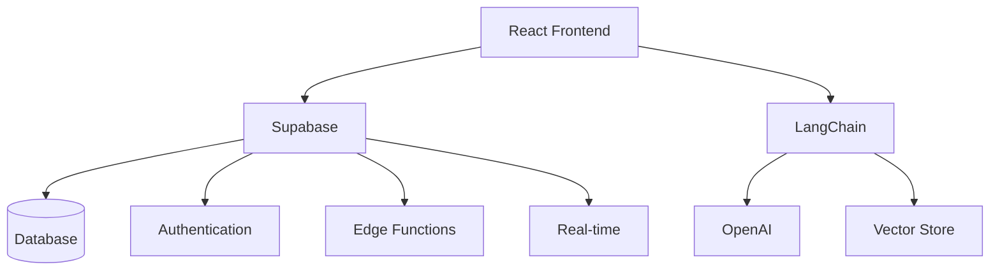

# Software Design Document (SDD)

## 1. System Architecture Overview 🏗️

### 1.1 High-Level Architecture


### 1.2 Key Components
- **Frontend Application (React)**
  - Single Page Application (SPA)
  - Tailwind & ShadCN UI components
  - Real-time subscriptions
  - Responsive design
  - Progressive enhancement

- **Backend Services (Supabase)**
  - Authentication & Authorization
  - Real-time Database
  - Edge Functions
  - Storage
  - Row Level Security (RLS)

- **AI Integration (Week 2)**
  - Ticket Classification
  - Knowledge Base Search
  - Sentiment Analysis
  - Smart Routing

### 1.3 Cross-Cutting Concerns
- Security & Compliance
- Performance & Scalability
- Error Handling & Logging
- Monitoring & Analytics
- Accessibility (a11y)

## 2. Component Design 🔨

### 2.1 Frontend Components

#### Core Layout
- **Shell**
  - Navigation
  - User Menu
  - Theme Toggle
  - Notifications

- **Dashboard**
  - Overview Cards
  - Quick Actions
  - Recent Activity
  - Performance Metrics

#### Feature Components
- **Ticket Management**
  ```typescript
  // components/tickets/TicketList.tsx
  interface TicketListProps {
    view: 'all' | 'assigned' | 'unassigned';
    filters?: TicketFilters;
    sorting?: SortOptions;
  }

  // components/tickets/TicketDetail.tsx
  interface TicketDetailProps {
    ticketId: string;
    onUpdate?: (ticket: Ticket) => void;
    onAssign?: (userId: string) => void;
  }
  ```

- **Knowledge Base**
  ```typescript
  // components/kb/ArticleEditor.tsx
  interface ArticleEditorProps {
    article?: Article;
    onSave: (article: ArticleData) => Promise<void>;
    onPublish?: (id: string) => Promise<void>;
  }

  // components/kb/SearchInterface.tsx
  interface SearchProps {
    onSearch: (query: string) => Promise<SearchResult[]>;
    suggestions?: string[];
    categories?: Category[];
  }
  ```

- **Communication Hub**
  ```typescript
  // components/chat/ChatWindow.tsx
  interface ChatWindowProps {
    ticketId: string;
    customerId: string;
    agentId?: string;
  }

  // components/email/EmailComposer.tsx
  interface EmailComposerProps {
    ticketId: string;
    template?: EmailTemplate;
    attachments?: File[];
  }
  ```

### 2.2 State Management

#### Auth Store
```typescript
interface AuthState {
  user: User | null;
  session: Session | null;
  loading: boolean;
  error: Error | null;
}

interface AuthActions {
  login: (email: string, password: string) => Promise<void>;
  logout: () => Promise<void>;
  updateProfile: (data: Partial<User>) => Promise<void>;
}
```

#### Ticket Store
```typescript
interface TicketState {
  tickets: Record<string, Ticket>;
  loading: boolean;
  error: Error | null;
  filters: TicketFilters;
  sorting: SortOptions;
}

interface TicketActions {
  fetchTickets: () => Promise<void>;
  createTicket: (data: NewTicket) => Promise<string>;
  updateTicket: (id: string, data: Partial<Ticket>) => Promise<void>;
  assignTicket: (id: string, userId: string) => Promise<void>;
}
```

### 2.3 Data Models

#### Core Models
```typescript
interface User {
  id: string;
  email: string;
  fullName: string;
  role: UserRole;
  teamId?: string;
  preferences: UserPreferences;
  metadata: Record<string, unknown>;
}

interface Ticket {
  id: string;
  subject: string;
  description: string;
  status: TicketStatus;
  priority: PriorityLevel;
  assigneeId?: string;
  customerId: string;
  teamId?: string;
  categoryId?: string;
  tags: string[];
  metadata: Record<string, unknown>;
  createdAt: Date;
  updatedAt: Date;
  dueAt?: Date;
  resolvedAt?: Date;
}

interface Article {
  id: string;
  title: string;
  content: string;
  categoryId?: string;
  authorId: string;
  status: ArticleStatus;
  version: number;
  tags: string[];
  metadata: Record<string, unknown>;
  createdAt: Date;
  updatedAt: Date;
  publishedAt?: Date;
}
```

## 3. Integration Points 🔌

### 3.1 Authentication Flow
```typescript
// hooks/auth/useAuth.ts
export function useAuth() {
  const { user, session } = useSupabaseAuth()
  const { setUser, clearUser } = useAuthStore()

  useEffect(() => {
    if (session?.user) {
      setUser(session.user)
    } else {
      clearUser()
    }
  }, [session])

  return {
    user,
    isAuthenticated: !!session,
    role: user?.role
  }
}
```

### 3.2 Real-time Updates
```typescript
// hooks/tickets/useTicketUpdates.ts
export function useTicketUpdates(ticketId: string) {
  const queryClient = useQueryClient()
  
  useEffect(() => {
    const subscription = supabase
      .from(`tickets:id=eq.${ticketId}`)
      .on('UPDATE', (payload) => {
        queryClient.setQueryData(['tickets', ticketId], payload.new)
      })
      .subscribe()

    return () => {
      subscription.unsubscribe()
    }
  }, [ticketId])
}
```

### 3.3 File Handling
```typescript
// services/storage.ts
export async function uploadAttachment(
  ticketId: string,
  file: File
): Promise<string> {
  const path = `tickets/${ticketId}/${file.name}`
  const { data, error } = await supabase.storage
    .from('attachments')
    .upload(path, file)

  if (error) throw error
  return data.path
}
```

## 4. Security Implementation 🔒

### 4.1 Row Level Security
```sql
-- Ticket access policy
CREATE POLICY "ticket_access_policy" ON tickets
FOR ALL USING (
  -- Customers can only view their own tickets
  (auth.uid() = customer_id) OR
  -- Agents can view tickets assigned to them or their team
  (auth.uid() = assignee_id OR
   EXISTS (
     SELECT 1 FROM users
     WHERE id = auth.uid()
     AND role IN ('agent', 'admin', 'team_lead')
     AND team_id = tickets.team_id
   ))
);
```

### 4.2 API Security
```typescript
// middleware/auth.ts
export async function validateSession(
  req: Request,
  res: Response,
  next: NextFunction
) {
  const token = req.headers.authorization?.split(' ')[1]
  if (!token) {
    return res.status(401).json({ error: 'No token provided' })
  }

  try {
    const { data: { user }, error } = await supabase.auth.getUser(token)
    if (error) throw error
    req.user = user
    next()
  } catch (error) {
    res.status(401).json({ error: 'Invalid token' })
  }
}
```

## 5. Error Handling 🚨

### 5.1 Global Error Boundary
```typescript
// components/error/ErrorBoundary.tsx
export class ErrorBoundary extends React.Component<
  { children: React.ReactNode },
  { hasError: boolean; error?: Error }
> {
  static getDerivedStateFromError(error: Error) {
    return { hasError: true, error }
  }

  componentDidCatch(error: Error, errorInfo: React.ErrorInfo) {
    console.error('Error caught by boundary:', error, errorInfo)
    // Log to error tracking service
  }

  render() {
    if (this.state.hasError) {
      return <ErrorFallback error={this.state.error} />
    }
    return this.props.children
  }
}
```

### 5.2 API Error Handling
```typescript
// utils/api-client.ts
export async function handleApiResponse<T>(
  response: Response
): Promise<T> {
  if (!response.ok) {
    const error = await response.json()
    throw new ApiError(response.status, error.message)
  }
  return response.json()
}
```

## 6. Performance Optimization 🚀

### 6.1 Query Optimization
```typescript
// hooks/tickets/useTickets.ts
export function useTickets(filters: TicketFilters) {
  return useQuery({
    queryKey: ['tickets', filters],
    queryFn: () => fetchTickets(filters),
    staleTime: 1000 * 60 * 5, // 5 minutes
    cacheTime: 1000 * 60 * 30, // 30 minutes
    select: (data) => ({
      tickets: data.tickets,
      total: data.total,
      hasMore: data.hasMore
    })
  })
}
```

### 6.2 Component Optimization
```typescript
// components/tickets/TicketListItem.tsx
export const TicketListItem = memo(
  function TicketListItem({ ticket }: { ticket: Ticket }) {
    const shouldUpdate = (prev: Ticket, next: Ticket) => {
      return (
        prev.status === next.status &&
        prev.priority === next.priority &&
        prev.assigneeId === next.assigneeId
      )
    }
    
    return (
      <div className="p-4 border-b">
        <h3>{ticket.subject}</h3>
        <TicketMeta ticket={ticket} />
      </div>
    )
  }
)
```

## 7. Monitoring & Logging 📈

### 7.1 Performance Monitoring
```typescript
// utils/monitoring.ts
export function trackPageLoad(page: string) {
  const metrics = {
    FCP: performance.getEntriesByName('first-contentful-paint')[0],
    LCP: performance.getEntriesByName('largest-contentful-paint')[0],
    FID: performance.getEntriesByName('first-input-delay')[0]
  }

  PostHog.capture('page_load', {
    page,
    metrics,
    timestamp: Date.now()
  })
}
```

### 7.2 Error Tracking
```typescript
// utils/error-tracking.ts
export function trackError(error: Error, context?: Record<string, unknown>) {
  Sentry.captureException(error, {
    extra: context,
    tags: {
      environment: process.env.NODE_ENV,
      version: process.env.APP_VERSION
    }
  })
}
```

---
*Last Updated: 2024-01-20*
*Version: 1.1*
*Owner: Engineering Team* 